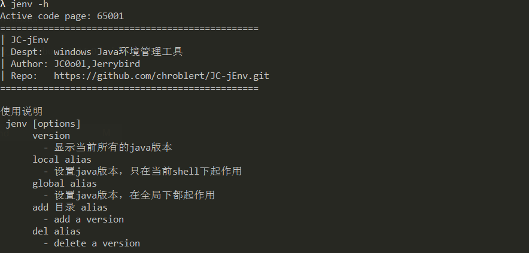
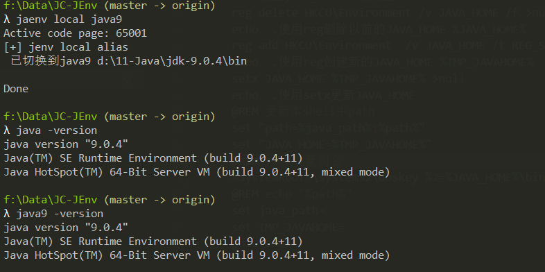
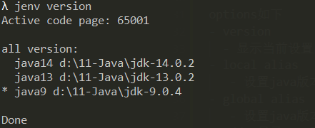
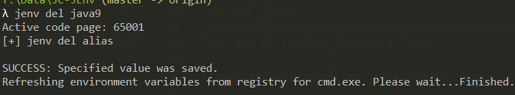
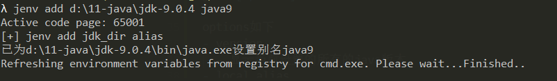

# JC-jEnv

> Author: JC0o0l,Jerrybird
> 
> GitHub: https://github.com/chroblert/JC-jEnv.git
> 
> WeChat: JC_SecNotes(Zer0ne安全研究)

## 0x00 用途
Java版本切换工具,可以很方便的在java的多个版本之间切换。可以设置只在当前的终端中生效还是在全局都生效。

## 0x01 原理：

- 通过reg,set,setx等命令修改或刷新JAVA_HOME,PATH,`<alias>`等环境变量以及注册表。

- 将添加的`<alias>`保存到用户环境变量JC_jEnv中

- 通过call来达到多重嵌套的效果

- 通过doskey来设置命令别名

## 0x02 效果：

`jenv -h`

`jenv local java9`

`jenv version`

`jenv del java9`

`jenv add d:\11-java\jdk-9.0.4 java9`

## 0x03 参数说明：

`jenv [options]`

options如下
- version 
  - 显示当前设置的所有的java版本
- local `<alias>` 
   - 设置java版本，只在当前shell下起作用
- global `<alias>`
   - 设置java版本，在全局下都起作用
- add <目录> `<alias>`
   - 添加一个版本的java。
   - 如：`jenv add d:\java\jdk-9.0.4 java9`
- del `<alias>`   
   - 删除一个版本的java
   - 如：`jenv del java9`

## 0x04 使用说明：

1. 将该bat脚本添加到PATH系统环境变量中

    这样使用的时候，可以直接输入`jenv`
2. 用户环境变量PATH中使用%JAVA_HOME%\bin
    
    path环境变量中不能有具体的java路径，要使用%JAVA_HOME%\bin的方式,无论系统环境变量还是用户环境变量

3. 删除系统环境变量中的JAVA_HOME
   因为生成path环境变量的时候，系统变量中的path>用户环境变量中的path。而要修改系统环境变量，需要管理员权限，所以该程序只修改了用户环境变量。

注：
> - 系统环境变量中PATH值中的路径下不能有java.exe。如：C:\windows\system32路径下有8版本的java.exe，则全局无法生效，即：即使jenv global java13,但每次新创建的cmd下运行的java都是C:\windows\system32路径下的那个。
> - 该脚本使用用户环境变量，因而系统环境变量中不能有JAVA_HOME变量

## 0x05 测试环境

|序号|系统|版本|是否支持|
|---|-|--|--------|
|1|Windows 10|专业版|支持|
|2|  |  |  |
|3|  |  |  |
|4|  |  |  |

##  参考资料：

参考资料：[windows系统一键配置修改环境变量](https://www.jianshu.com/p/7d90042f644f)

参考资料：[Windows设置cmd别名](https://blog.csdn.net/YiRanZhiLiPoSui/article/details/83116819)

参考资料：[setx设置永久环境变量](https://blog.csdn.net/fm0517/article/details/52450940)

参考资料：[刷新环境变量](https://github.com/chocolatey/choco/blob/master/src/chocolatey.resources/redirects/RefreshEnv.cmd)

参考资料：[batch之变量延迟](https://www.cnblogs.com/ini_always/archive/2012/02/16/2355031.html)

参考资料：[was unexpect at this time](https://stackoom.com/question/2pffV/%E8%9D%99%E8%9D%A0-Set%E5%91%BD%E4%BB%A4%E5%9C%A8%E6%8B%AC%E5%8F%B7%E5%86%85%E4%B8%8D%E8%B5%B7%E4%BD%9C%E7%94%A8)

参考资料：[批处理变量多重嵌套](https://www.cnblogs.com/xxcanghai/p/4584042.html)

参考资料：[环境变量中特殊字符()的问题](https://qastack.cn/superuser/119610/spaces-and-parenthesis-in-windows-path-variable-screws-up-batch-files)

参考资料：[setx1024个字符限制的解决方法](https://qastack.cn/superuser/387619/overcoming-the-1024-character-limit-with-setx)